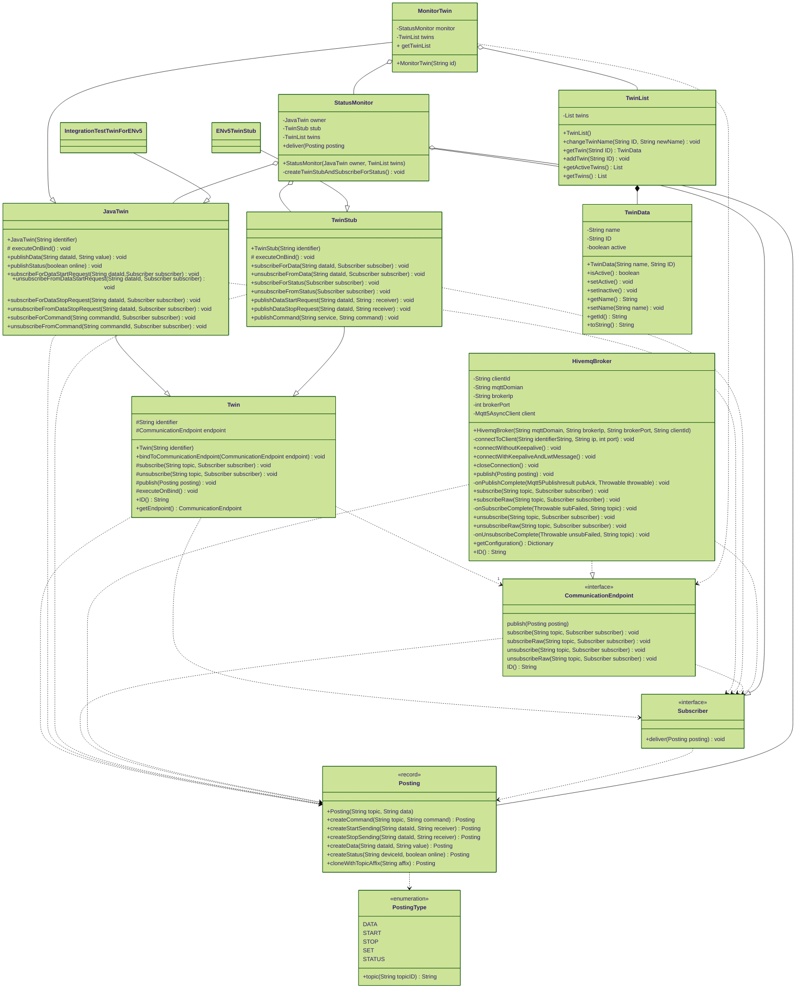

# How to contribute

## Naming Scheme

|     Scope | Scheme               | Notes |
|----------:|:---------------------|:------|
|     Files | PascalCase           |       |
|     Class | PascalCase           |       |
| Functions | camelCase            |       |
| Variables | camelCase            |       |
| Constants | SCREAMING_SNAKE_CASE |       |

## Publish Modifications

Don't push directly to the `main` branch. Push your modification to a new branch and open a pull request to `main`, so
that the maintainer of this repository can merge your modifications.

## Class Structure

