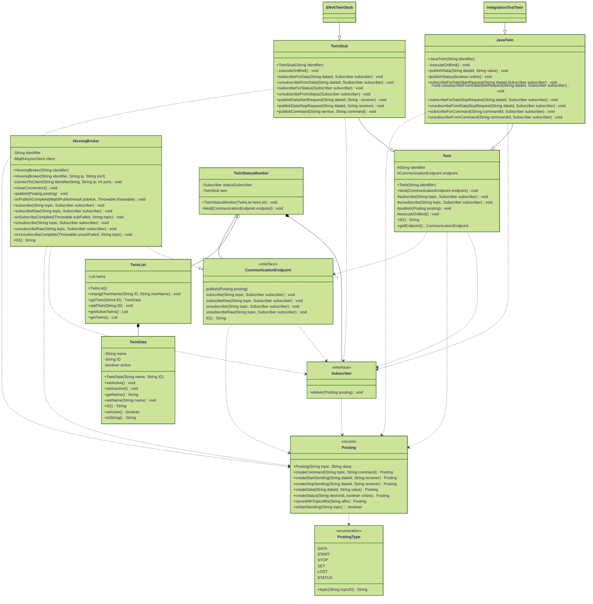

# How to contribute

## Runtime

Class Structure:

```mermaid
%%{init: {"theme": "forest"} }%%
classDiagram
  class Twin {
    #String identifier
    #CommunicationEndpoint endpoint

    +Twin(String identifier)

    +bind(CommunicationEndpoint endpoint) void
    #subscribe(String topic, Subscriber subscriber) void
    #unsubscribe(String topic, Subscriber subscriber) void
    #publish(Posting posting) void
    #executeOnBind() void
    +ID() String
    +getEndpoint() CommunicationEndpoint
  }
  Twin ..> Subscriber
  Twin ..> Posting
  Twin ..> "1" CommunicationEndpoint

  class JavaTwin {
    +JavaTwin(String identifier)

    - executeOnBind() void
    +publishData(String dataId, String value) void
    +publishStatus(boolean online) void
    +subscribeForDataStartRequest(String dataId,Subscriber subscriber) void
    +void unsubscribeFromDataStartRequest(String dataId, Subscriber subscriber) void
    +subscribeForDataStopRequest(String dataId, Subscriber subscriber) void
    +unsubscribeFromDataStopRequest(String dataId, Subscriber subscriber) void
    +subscribeForCommand(String commandId, Subscriber subscriber) void
    +unsubscribeFromCommand(String commandId, Subscriber subscriber) void
  }
  JavaTwin --|> Twin
  JavaTwin ..> Subscriber
  JavaTwin ..> Posting

  class TwinStub {
    +TwinStub(String identifier)

    - executeOnBind() void
    +subscribeForData(String dataId, Subscriber subsciber) void
    +unsubscribeFromData(String dataId, Scubscriber subscriber) void
    +subscribeForStatus(Subscriber subscriber) void
    +unsubscribeFromStatus(Subscriber subscriber) void
    +publishDataStartRequest(String dataId, String : receiver) void
    +publishDataStopRequest(String dataId, String receiver ) void
    +publishCommand(String service, String command) void
  }
  TwinStub --|> Twin
  TwinStub ..> Subscriber
  TwinStub ..> Posting

  class CommunicationEndpoint {
    <<interface>>
    publish(Posting posting)
    subscribe(String topic, Subscriber subscriber) void
    subscribeRaw(String topic, Subscriber subscriber) void
    unsubscribe(String topic, Subscriber subscriber) void
    unsubscribeRaw(String topic, Subscriber subscriber) void
    ID() String
  }
  CommunicationEndpoint ..> Subscriber
  CommunicationEndpoint ..> Posting

  class HivemqBroker {
    -String identifier
    -Mqtt5AsyncClient client

    +HivemqBroker(String identifier)
    +HivemqBroker(String identifier, String ip, String port)

    -connectToClient(String identifierString, String ip, int port) void
    +closeConnection() void
    +publish(Posting posting) void
    -onPublishComplete(Mqtt5Publishresult pubAck, Throwable throwable) void
    +subscribe(String topic, Subscriber subscriber) void
    +subscribeRaw(String topic, Subscriber subscriber) void
    -onSubscribeComplete(Throwable subFailed, String topic) void
    +unsubscribe(String topic, Subscriber subscriber) void
    +unsubscribeRaw(String topic, Subscriber subscriber) void
    -onUnsubscribeComplete(Throwable unsubFailed, String topic) void
    +ID() String
  }
  HivemqBroker ..|> CommunicationEndpoint
  HivemqBroker ..> Subscriber
  HivemqBroker ..> Posting

  class PostingType {
    <<enumeration>>
    DATA
    START
    STOP
    SET
    LOST
    STATUS

    +topic(String topicID) String
  }

  class Posting {
    <<record>>
    +Posting(String topic, String data)

    +createCommand(String topic, String command) Posting
    +createStartSending(String dataId, String receiver) Posting
    +createStopSending(String dataId, String receiver) Posting
    +createData(String dataId, String value) Posting
    +createStatus(String deviceId, boolean online) Posting
    +cloneWithTopicAffix(String affix) Posting
    +isStartSending(String topic) : boolean
  }
  Posting ..> PostingType

  class Subscriber {
    <<interface>>
    +deliver (Posting posting) void
  }
  Subscriber ..> Posting

  class TwinData {
    -String name
    -String ID
    -boolean active

    +TwinData(String name, String ID)

    +setActive() void
    +setInactive() void
    +getName() String
    +setName(String name) void
    +ID() String
    +isActive() boolean
    +toString() String
  }

  class TwinList {
    -List<TwinData> twins

    +TwinList()

    +changeTwinName(String ID, String newName) void
    +getTwin(Strind ID) TwinData
    +addTwin(String ID) void
    +getActiveTwins() List<TwinData>
    +getTwins() List<TwinData>
  }
  TwinList *-- TwinData

  class TwinStatusMonitor {
    -Subscriber statusSubscriber
    -TwinStub twin

    +TwinStatusMonitor(TwinList twinList) void

    +bind(CommunicationEndpoint endpoint) void
  }
  TwinStatusMonitor *-- Subscriber
  TwinStatusMonitor o-- TwinList
  TwinStatusMonitor o-- CommunicationEndpoint

  ENv5TwinStub --|> TwinStub
  IntegrationTestTwin --|> JavaTwin
```
