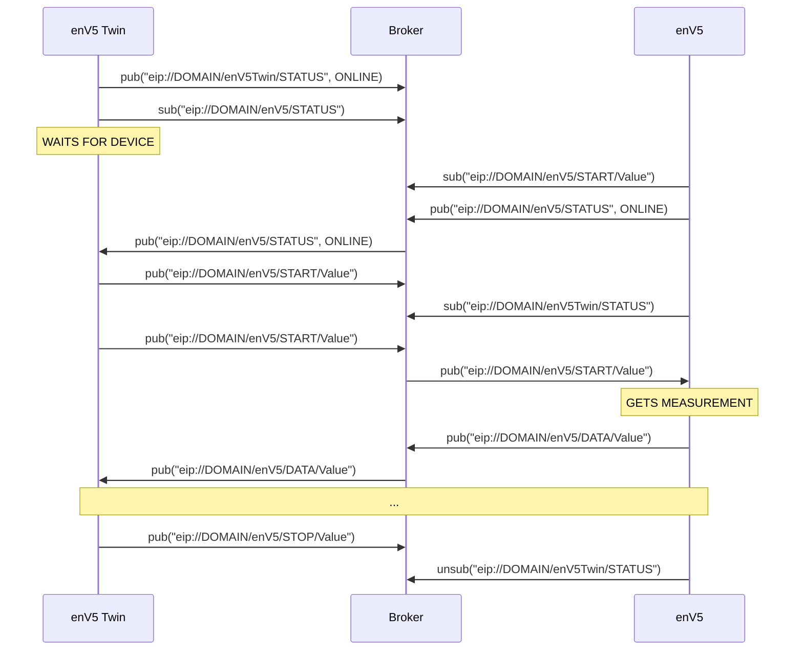
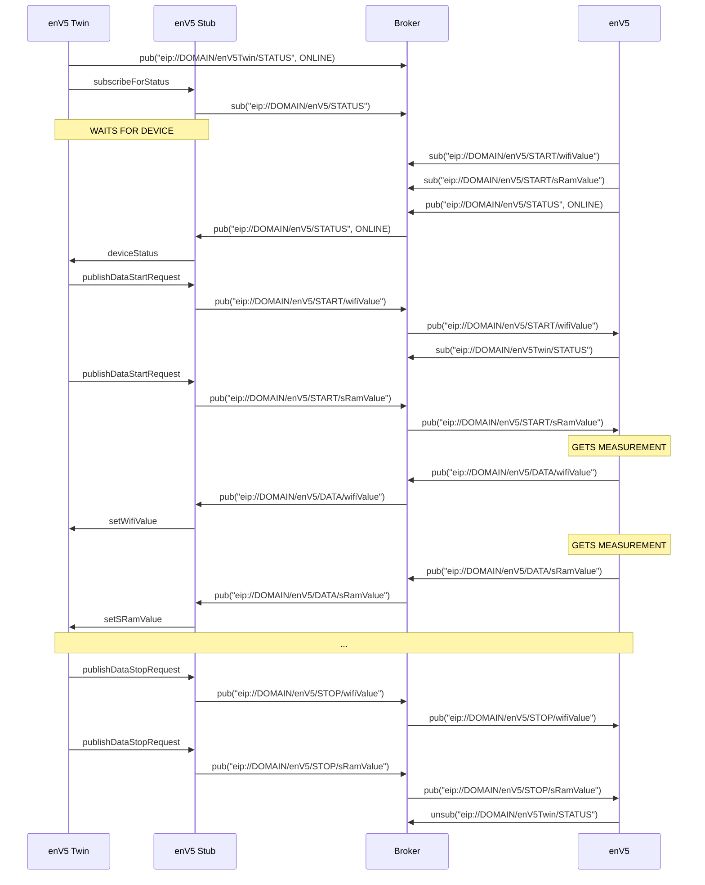
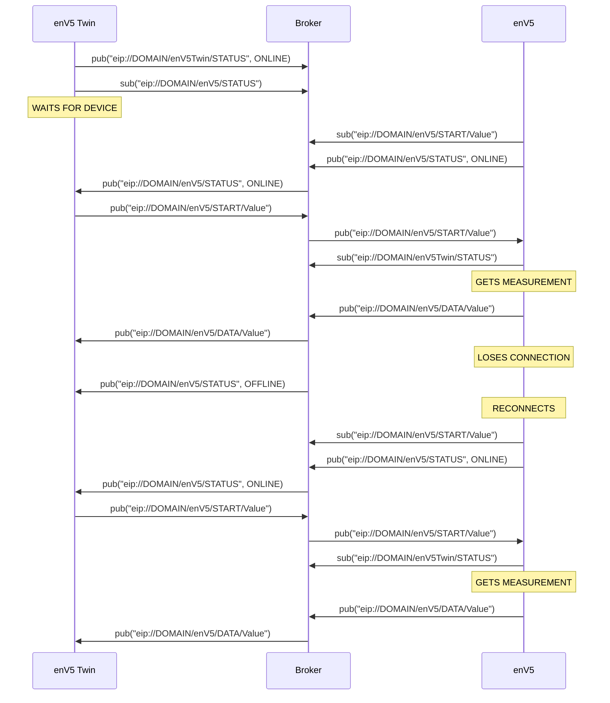
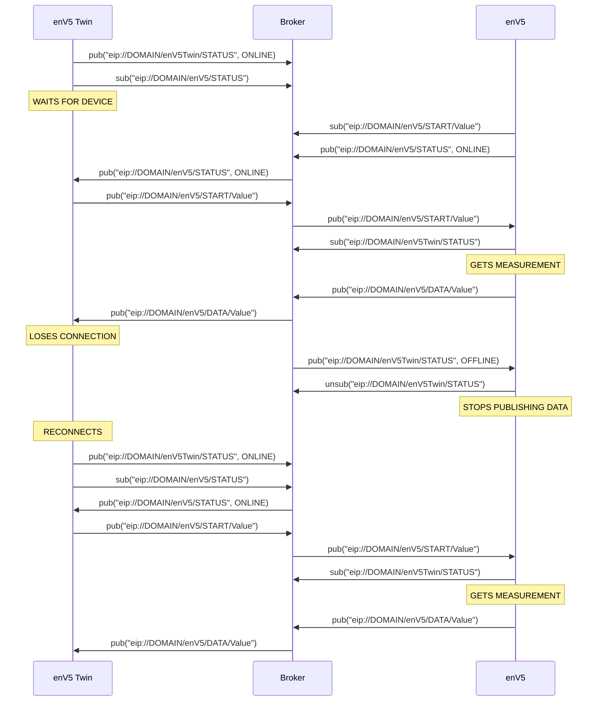

# DEMO

[Simplified Overview](#Simplified-Overview)

[Detailed Overview](#Detailed-Overview)

[Simplified Device Loses Connection](#Simplified-Device-Loses-Connection)

[Simplified Twin Loses Connection](#Simplified-Twin-Loses-Connection)

## Simplified Overview

PowerConsumption twin gets online and waits for device, when device comes online data is requested.
After some time data is requested no longer.
Twin Stub included in PowerConsumptionTwin.
Requested Values combined into VALUE.

## Detailed Overview

PowerConsumption twin gets online and waits for device, when device comes online data is requested. After some time data is requested no longer.

## Simplified Device Loses Connection

## Simplified Twin Loses Connection

