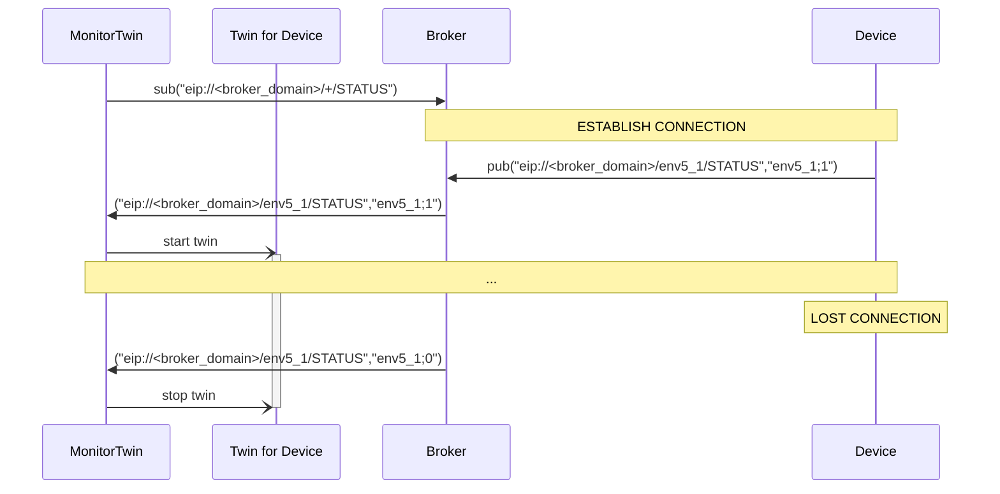
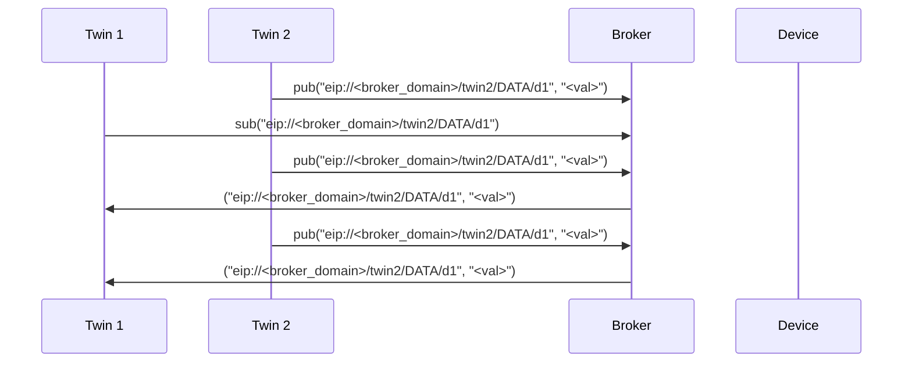
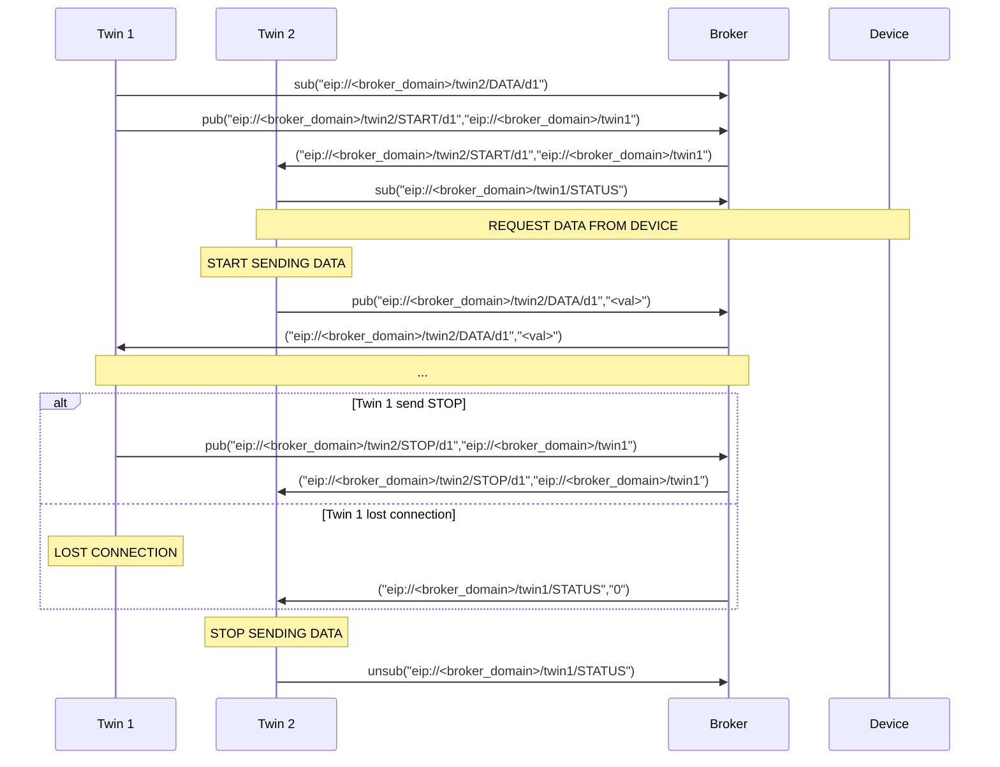
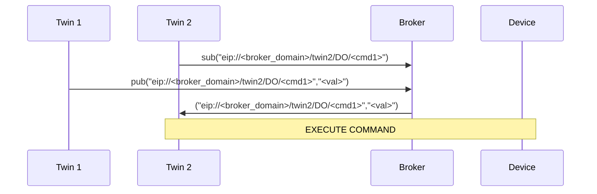
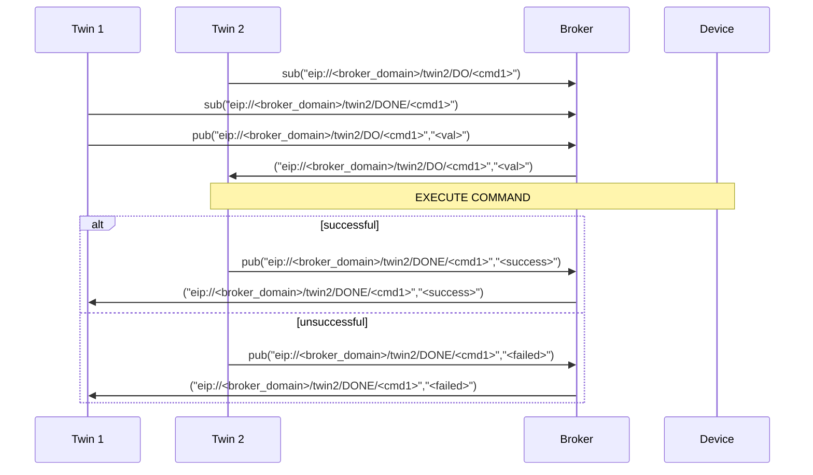

# EIP Protocol (v0.2)

The eip protocol is a specification of a publish/subscribe based star topology with a broker at the center.
Typically, this will be implemented via MQTT, but this is **not** fixed.
The basic functionality provided are _subscribing_, _unsubscribing_ and _publishing_ to and from topics and topic filters, together with a keepalive mechanism with last will message.

## Message

A message consists of a topic combined with a payload/data that should be published to the given topic.

### Topic

A topic is constructed as followed:

```
eip://<broker_domain>/<object_id>/<message_type>/<type_dependent>
```

where the `<object_id>` is the individual identifier of the target device and the `<message_type>/<type_dependant>` is defined as in the part [Message Types](#message-types).

### Message Types

|   Type | Description                                                       |
| -----: | :---------------------------------------------------------------- |
| STATUS | a message containing the online(1)/offline(0) status of an object |
|  START | a message requesting an object to start sending a stream of data  |
|   STOP | a message requesting an object to stop sending a stream of data   |
|   DATA | a message containing data                                         |
|     DO | a message containing a command                                    |
|   DONE | a message containing the response to a DO message                 |

#### STATUS

- Topic: `eip://<broker_domain>/<object_id>/STATUS`
- Data: `<object_id>` AND 0 (offline) OR 1 (online)
- Information:
  - The retain-flag of this message should be set to assure status discovery for newly entered participants!
  - The offline message should be automatically send by the broker after connection loss (LWT message).
  - The online message should only be sent by a new hardware device or Application Twin.

Example message:

```text
("eip://uni-due.de/es/twin1/STATUS","twin1;1")
("eip://uni-due.de/es/twin1/STATUS","twin1;0")
```

Communication Specification:



#### START

- Topic: `eip://<broker_domain>/<object_id>/START/<data_id>`
- Data: topic specifying `eip://<broker_domain>/<object_id>` that is interested in data

Example message:

```text
("eip://uni-due.de/es/twin1/START/light","eip://uni-due.de/es/twin2")
```

#### STOP

- Topic: `eip://<broker_domain>/<object_id>/STOP/<data_id>`
- Data: topic specifying `eip://<broker_domain>/<object_id>` that was interested in data

Example message:

```text
("eip://uni-due.de/es/twin1/STOP/light","eip://uni-due.de/es/twin2")
```

#### DATA

- Topic: `eip://<broker_domain>/<object_id>/DATA/<data_id>`
- Data: value encoded as a string
- INFO:
  - Interested nodes can subscribe to this topic to receive new data

Example message:

```text
("eip://uni-due.de/es/twin1/DATA/light","30.7")
```

Communication specification for data that is published **continuously**:



Communication for data that has to be **requested**:



#### DO

- Topic: `eip://<broker_domain>/<object_id>/DO/<command>`
- Data: command specific

Example message:

```text
("eip://uni-due.de/es/twin1/DO/SET/led/1","1")
```

Communication specification for a command **without** response:



#### DONE

- Topic: `eip://<broker_domain>/<object_id>/DONE/<command>`
- Data: command specific

Example message:

```text
("eip://uni-due.de/es/twin1/DONE/SET/led/1","1")
```

Communication specification for a command **with** response:


