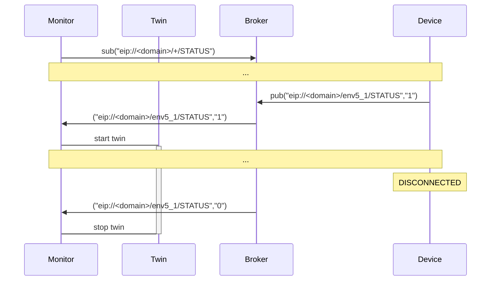
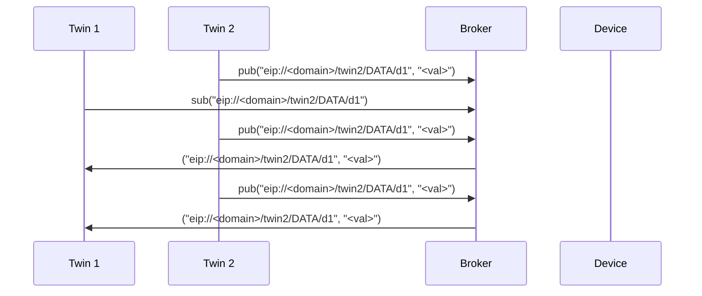
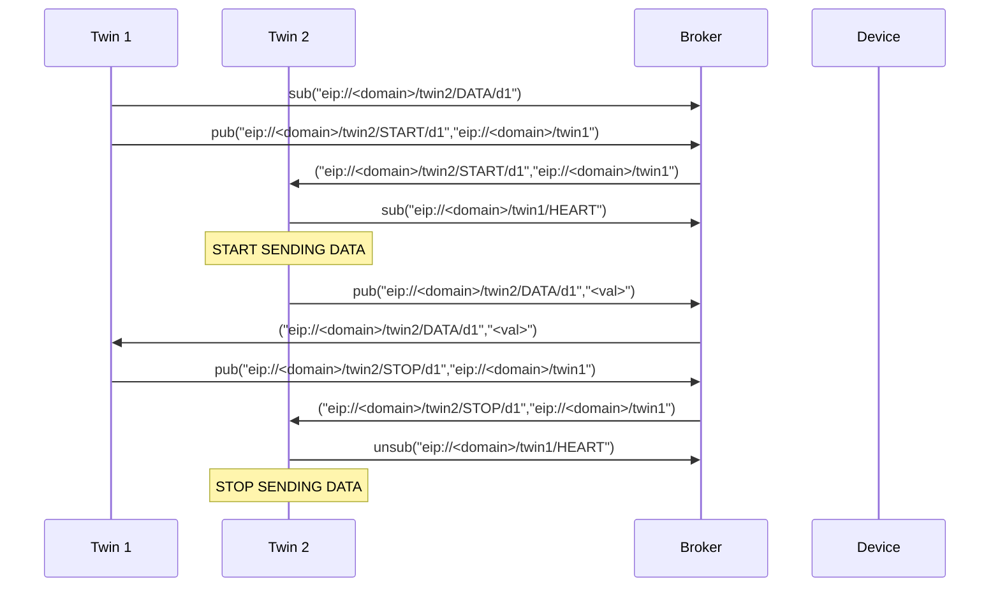

# EIP Protocol (v0.2)

The eip protocol is a specification of a publish/subscribe bases start topology with a broker at the center.
Typically this will be implemented via MQTT bit this is **not** fixed.
The basic functionality provided are _subscribing_, _unsubscribing_ and _publishing_ from topics and topic filters.

## Message

A message consists of a topic combined with payload/data that should be published to the given topic.

### Topic

A topic is constructed as followed:

```
eip://<domain>/<object>/<message_type>/<type_dependent>
```

where the `<object>` is the individual identifier of the target device and the `<message_type>` is defined as in the part [Message Types](#message-types).

### Message Types

|   Type | Description                                                       |
|-------:|:------------------------------------------------------------------|
| STATUS | a message containing the online(1)/offline(0) status of an object |
|  HEART | a heartbeat message **(replaced by STATUS!)**                     |
|  START | a message requesting an object to start sending a stream of data  |
|   STOP | a message requesting an object to stop sending a stream of data   |
|   DATA | a message containing data                                         |
|     DO | a message containing a command                                    |
|   DONE | a message containing the response to a command                    | 

#### STATUS

* Topic: `eip://<domain>/<object>/STATUS`
* Data: 0 (offline) OR 1 (online)
* INFO:
    * The retain-flag of this message should be set!
    * The offline message should be automatically send by the broker after connection loss

Example message:

```text
("eip://uni-due.de/es/twin1/STATUS","1")
("eip://uni-due.de/es/twin1/STATUS","0")
```

Communication Specification:



#### HEART

* Topic: `eip://<domain>/<object>/HEART`
* Data: empty **OR** ID of the twin in case of physical object

Example message:

```text
("eip://uni-due.de/es/twin1/HEART","")
```

#### START

* Topic: `eip://<domain>/<object>/START/<data_id>`
* Data: topic specifying object that is interested in data

Example message:

```text
("eip://uni-due.de/es/twin1/START/light","eip://uni-due.de/es/twin2")
```

#### STOP

* Topic: `eip://<domain>/<object>/STOP/<data_id>`
* Data: topic specifying object that is interested in data

Example message:

```text
("eip://uni-due.de/es/twin1/STOP/light","eip://uni-due.de/es/twin2")
```

#### DATA

* Topic: `eip://<domain>/<object>/DATA/<data_id>`
* Data: value encoded as a string
* INFO:
    * Interested nodes can subscribe to this topic to receive new data

Example message:

```text
("eip://uni-due.de/es/twin1/DATA/light","30.7")
```

Communication specification for data that is published continuously:



Communication for data that has to be requested:
<!-- TODO: needs to be redone considering STATUS instead of HEART -->



#### DO

* Topic: `eip://<domain>/<object>/DO/<command>`
* Data: command specific

Example message:

```text
("eip://uni-due.de/es/twin1/DO/SET/led/1","1")
```

#### DONE

* Topic: `eip://<domain>/<object>/DONE/<command>`
* Data: command specific

Example message:

```text
("eip://uni-due.de/es/twin1/DONE/SET/led/1","1")
```
