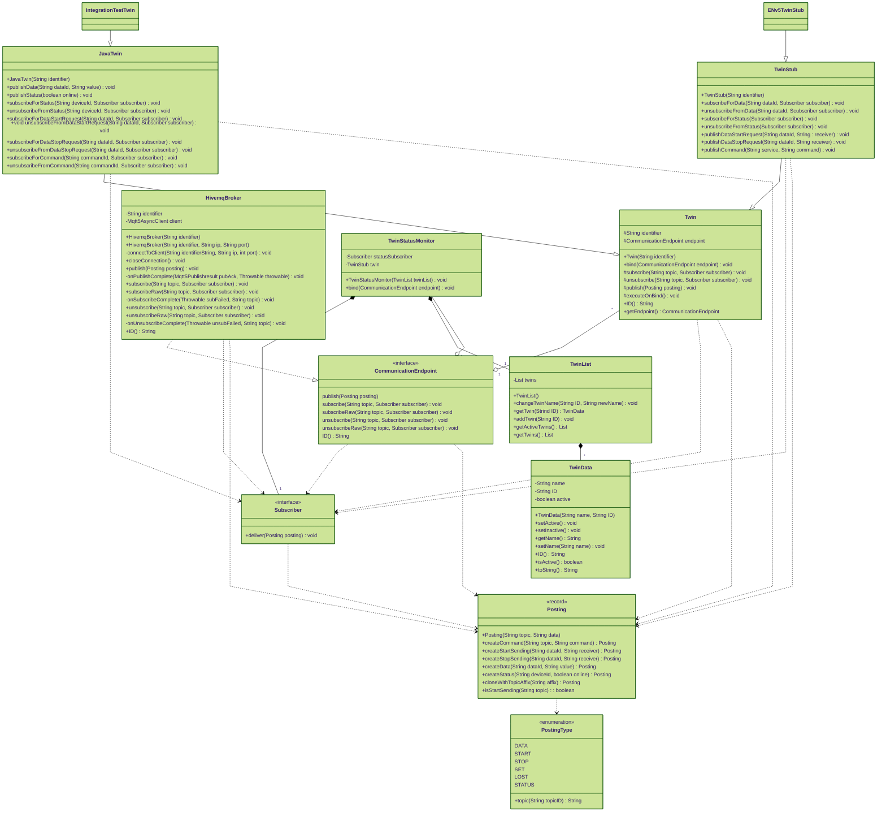

[](https://github.com/es-ude/elastic-ai.runtime/actions/workflows/unitTests.yml)
[](https://github.com/es-ude/elastic-ai.runtime/actions/workflows/integrationTests.yml)

# elastic-AI.runtime

The elastic-AI.runtime provides a backend for operating digital twins.
It uses MQTT as a messaging protocol and is primarily focused on the use with the Elastic Node v5.
This repository uses the gradle multi-project feature and currently contains the following projects:

- elastic-ai.runtime:runtime
- elastic-ai.runtime:monitor

## Prerequisites

### Java

Requires Java Version **17**

### Docker

The project needs the [Docker](https://www.docker.com/)-CLI to run the integration tests, because a running MQTT Broker is needed to run successful as described in [MQTT Broker](#mqtt-broker).

### MQTT Broker

The runtime uses MQTT as the main communication protocol, therefore an MQTT Broker is needed to run the code locally.
You can either install a broker on your machine or run it via docker.
The default for the project is [Mosquitto](https://mosquitto.org/) by Eclipse.
The elastic-AI.runtime communicates with the broker on port 1883.
If you want the broker to communicate with the elasticNode over the network, you may need to open port 1883 on your local machine's firewall.

#### Run Mosquitto (native)

Check your local package manager.

#### Run Mosquitto (via Docker)

Run mosquitto via docker and the provided [mosquitto.conf](./mosquitto.conf) file:

```bash
docker run -p 1883:1883 -v $PWD/mosquitto.conf:/mosquitto/config/mosquitto.conf eclipse-mosquitto:1.6.14
```

The command will

1. Pull the 1.6.14 `eclipse-mosquitto` image from [dockerhub](https://hub.docker.com/)
2. Start the container with the passed mosquitto.conf
3. Expose access to the container via Port 1883 (MQTT)

The `mosquitto.conf` file should at least embed the following settings:

```text
listener 1883 0.0.0.0
allow_anonymous true
```

## Tests

Unit tests and integration tests can be executed independently. Both use _jacoco_ to finalize the tests with a report
that shows the test results and the code coverage.
The reports can be found in the location `build/reports/` relative to the corresponding build file.

### Test execution

| **Command**                          | **Task**                                                                                          |
|--------------------------------------|---------------------------------------------------------------------------------------------------|
| `gradle test`                        | Run ** all** unit tests                                                                           |
| `gradle: subproject:test`            | Run unit test from ** specific** subproject <br/> (i.g. `gradle :runtime:test`)                   |
| `gradle integrationTest`             | Run ** all** Integration test                                                                     |
| `gradle :subproject:integrationTest` | Run integration test from ** specific** subproject <br/> (i.g. `gradle: runtime:integrationTest`) |

## Project Structure



### Monitor

The monitor is used to provide an external interface for user to interact with the elastic-ai ecosystem.
This interface is provided via a java web application, which can be accessed via every common browser (e.g. Chrome, Firefox, Safari, ...).
To start the monitor run

```bash
./gradlew :monitor:run
```

The monitor can then be accessed locally at [http://localhost.com:8081](localhost.com:8081).

#### Exit Codes

| Exit Code | Description            |
|----------:|:-----------------------|
|         0 | No error               |
|        10 | Argument Parser failed |

### Runtime

The runtime is meant to provide the necessary functions to implement a backend for the elastic-ai ecosystem.
It provides the necessary function to operate the ecosystem, like the implementation of the Twin concept or the HiveMQBroker implementation together with the necessary functions to handle the MQTT Broker interactions.
