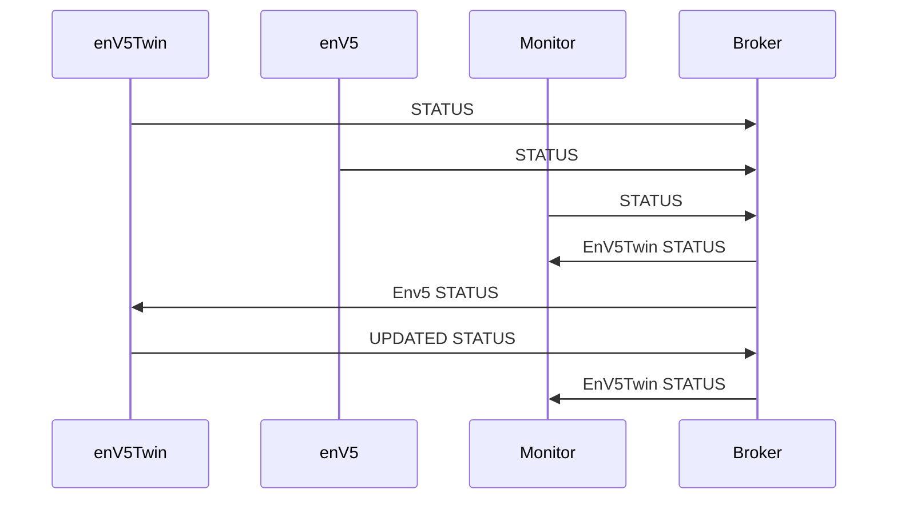
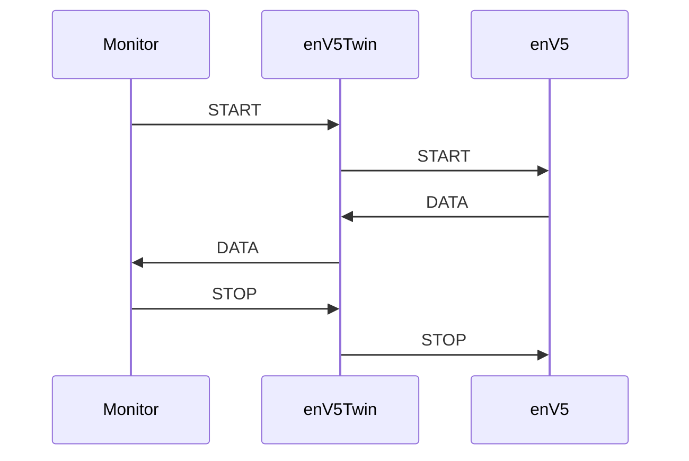
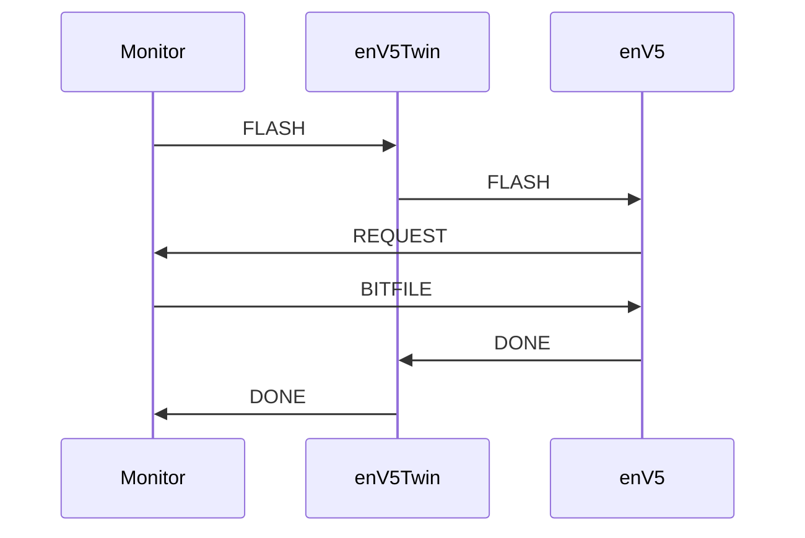

# DEMO

For running the DEMO, four components are needed. An MQTT Broker, the Monitor, the EnV5 Twin, and a EnV5 Device.

The three software components can be started together by using the docker compose file.
For this the Twin and Monitor docker images need to be built beforehand (See [README](../README.md#docker-container)).

```bash
docker compose up
```

## Communication

The diagrams show simplified, how the parties communicate with each other in the DEMO.

### Status



### DATA

Broker removed for simplicity



### FLASH

Broker removed for simplicity


